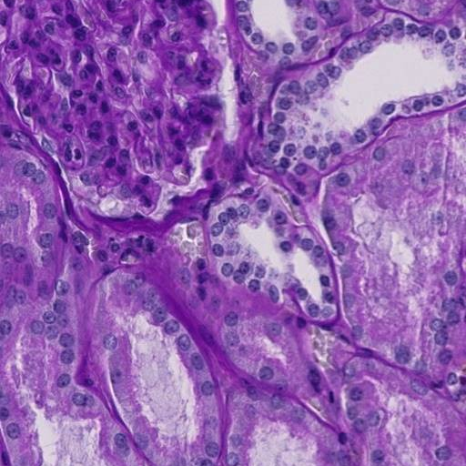

# kaggle-HuBMAP
HuBMAP - Hacking the Human Vasculature (Kaggle Competition)

## Image data overview
- training:
    - metadata summary csv: `metadata/trn_img_meta_7033.csv`
    - 7033 samples
    - 512 x 512 x 3
    - data type `uint8`
    - mean intensity across 3 channels:
    
    

    - stdev intensity across 3 channels:

    

    - sample image:

    
- test:
    - 1 sample
    - 512 x 512 x 3
    - data type `uint8`
    - mean 163.5
    - std 53.1
    - sample image:

     

## Provided CSVs
- tile:
    - location: `metadata/tile_meta_7033.csv`
    - columns:
        - id
        - source_wsi (patients from where WSIs were extracted)
            - 1-4, 6-14
            - source_wsi 1-4 described in `wsi_meta`
        - dataset:
            1. 422
            2. 1211
            3. 5400
    - dataset description:
        1. Annotations that have been expert reviewed.
        2. Comprises the remaining tiles from these same WSIs and contain sparse annotations that have not been expert reviewed.
        3. Tiles extracted from an additional nine WSIs. These tiles have not been annotated. You may wish to apply semi- or self-supervised learning techniques on this data to support your predictions.
        - i, j: upper-left corner within the WSI where the tile was extracted
- wsi (whole slide images):
    - source_wsi (4 patients: 3 females, 1 male)
    - age
    - sex
    - race
    - height (cm)
    - weight (kg)
    - bmi